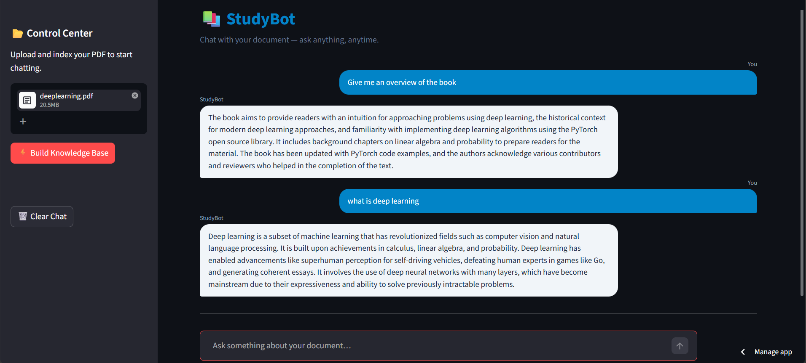

# StudyBot - RAG Based AI Chatbot

StudyBot is a Retrieval-Augmented Generation (RAG) chatbot built using Python, Streamlit, LangChain, ChromaDB, and MistralAI LLM.

The chatbot can read PDF and text documents, create embeddings, store them in a vector database, and answer user questions contextually.

---

# Features

- PDF Question Answering
- Text File Support
- Semantic Search
- Vector Database using ChromaDB
- Streamlit User Interface
- Dynamic Embedding Creation

---

# Demo

---
# Tech Stack

- Python
- Streamlit
- LangChain
- ChromaDB
- HuggingFace Embeddings
- MistralAI
- PyPDF
- Sentence Transformers

---

# Project Structure

```bash
StudyBot/
│
├── Document_Loader/
│   ├── deeplearning.pdf
│   ├── notes.txt
│   ├── page.py
│   ├── pdf.py
│   └── text.py
│
├── app.py
├── main.py
├── requirements.txt
├── README.md
└── .gitignore
````

---

# How It Works

1. Load PDF/Text documents
2. Split documents into chunks
3. Generate embeddings
4. Store embeddings in ChromaDB
5. Retrieve relevant context
6. Send context to Gemini LLM
7. Generate intelligent responses

---

# Installation

Clone the repository:

```bash
git clone https://github.com/YOUR_USERNAME/Studybot.git
cd Studybot
```

Install dependencies:

```bash
pip install -r requirements.txt
```

Create `.env` file:

```env
MISTRAL_API_KEY=your_api_key_here
```

Run the application:

```bash
streamlit run app.py
```

---

# Environment Variables

Required:

```env
MISTRAL_API_KEY=your_google_gemini_api_key
```

---

# Future Improvements

* Chat History Memory
* Multiple PDF Uploads
* Source Citations
* Authentication
* Cloud Vector Database
* Streaming Responses

---

# Deployment

This project can be deployed using:

* Streamlit


---

# Author

Ankita Ghosh

```
```
